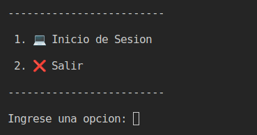

## ESTRUCTURA DE DATOS VD2S2023 PY 202100096 - FASE 1

## UNIVERSIDAD DE SAN CARLOS DE GUATEMALA

|**CARNET**  |      **NOMBRE COMPLETO**          |  
|----------|:-----------------------------------:|
|202100096 |  RIVER ANDERSON - ISMALEJ ROMAN     |    
| AUXILIAR |            CRISTIAN SUY             |   
| SECCION  |                "A"                  |   

#### 📌 MANUAL USUARIO

### **Objetivos Generales**
* Aplicar los conocimientos del curso Estructuras de Datos en el desarrollo de
las diferentes estructuras de datos y los diferentes algoritmos de
manipulación de la información en ellas.

---
>### **Login**
* Al iniciar el programa, contaremos con un login para iniciar sesion como Administrador o como Estudiante.

