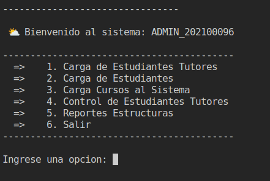
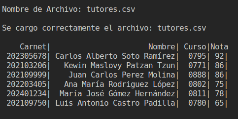
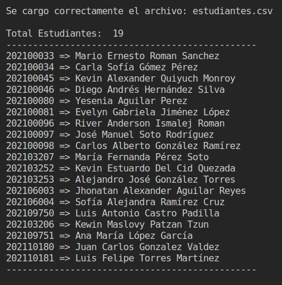
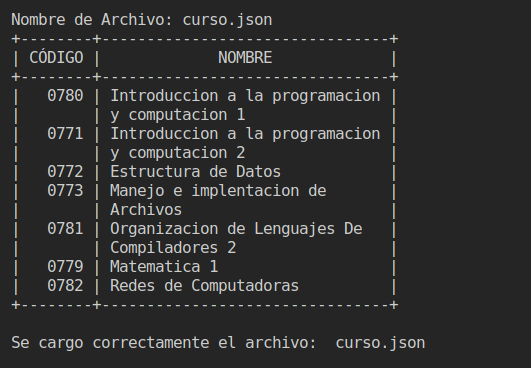
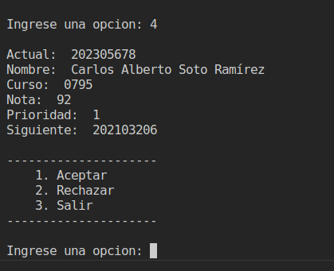
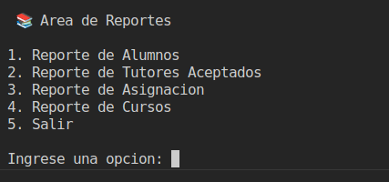
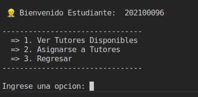
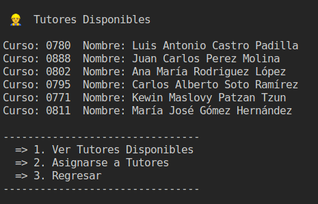
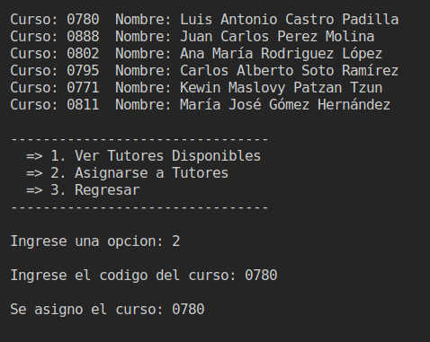

## ESTRUCTURA DE DATOS VD2S2023 PY 202100096 - FASE 1

## UNIVERSIDAD DE SAN CARLOS DE GUATEMALA

|**CARNET**  |      **NOMBRE COMPLETO**          |  
|----------|:-----------------------------------:|
|202100096 |  RIVER ANDERSON - ISMALEJ ROMAN     |    
| AUXILIAR |            CRISTIAN SUY             |   
| SECCION  |                "A"                  |  

#### 📌 MANUAL USUARIO

### **Objetivos Generales**
* Aplicar los conocimientos del curso Estructuras de Datos en el desarrollo de las diferentes estructuras de datos y los diferentes algoritmos de manipulación de la información en ellas.

---
>### **Login**
* Al iniciar el programa, contaremos con un login para iniciar sesión como Administrador o como Estudiante.

    

---
>### **Menu Administrador**
* Al iniciar sesión como administrador tendremos diferentes acciones por hacer cargar archivos de entradas, generar reportes gráficos y tener control sobre aceptar o rechazar Tutores Académicos.

    

---
#### **Carga de Tutores**

    

---
### **Carga de Estudiantes**

    

---

### **Carga de Cursos**

    

---
---
* Nota: Para cargar los archivos de entrada se debe colocar el nombre del archivo con extensión .csv.

---

### **Control de Estudiantes Tutores**

* Luego de cargar los tutores, contaremos con una opción para elegir qué tutores aceptar.

    

---

### **Reportes**

* En el Área de Reportes podremos generar gráficos, para poder visualizar las estructuras que se implementaron en el proyecto.

    

>### **Menu Estudiante**
* Al iniciar sesión como estudiante podremos ver los tutores disponibles y poder asignarnos a un tutor en específico ingresando el número de curso.

    

---

>#### **Tutores Disponibles**
* En ver Tutores Disponibles tendremos los tutores que fueron aceptados por el Administrador, con el curso que imparten mas su nombre.

    

---
>#### **Asignacion de Cursos**
* Para poder asignarnos un curso debemos de seleccionar la opcion de Asignarse a Tutores, luego de eso ingresar el codigo del curso, si el curso existe en sistema se asigna satisfactoriamente de lo contrario no.

    

---

#### 📌 MANUAL TECNICO

>### **Lista Enlazada Doble**

>##### **Se utilizo esta estructura para el manejo de ordenado de estudiante por medio de su carnet.**

    func (l *ListaDoble) AgregarOrdenado(carnet int, nombre string) {
	    nuevoEstudiante := &Estudiante{Carnet: carnet, Nombre: nombre}
	    nuevoNodo := &NodolistaDoble{Estudiante: nuevoEstudiante, Siguiente: nil, Anterior: nil}

	    if l.Contador == 0 {
		    l.Inicio = nuevoNodo
		    l.Inicio.Anterior = nuevoNodo
		    l.Inicio.Siguiente = nuevoNodo
		    l.Contador += 1
	    } else {
		    aux := l.Inicio
		    contador := 1
		    for contador < l.Contador {
			    if l.Inicio.Estudiante.Carnet > carnet {
				    nuevoNodo.Siguiente = l.Inicio
				    nuevoNodo.Anterior = l.Inicio.Anterior
				    l.Inicio.Anterior = nuevoNodo
				    l.Inicio = nuevoNodo
				    l.Contador++
				    return
			    }

			    if aux.Estudiante.Carnet < carnet {
				    aux = aux.Siguiente
			    } else {
				    nuevoNodo.Anterior = aux.Anterior
				    aux.Anterior.Siguiente = nuevoNodo
				    nuevoNodo.Siguiente = aux
				    aux.Anterior = nuevoNodo
				    l.Contador += 1
				    return
			    }
			    contador += 1
		    }
		    if aux.Estudiante.Carnet > carnet {
			    nuevoNodo.Siguiente = aux
			    nuevoNodo.Anterior = aux.Anterior
			    aux.Anterior.Siguiente = nuevoNodo
			    aux.Anterior = nuevoNodo
			    l.Contador += 1
			    return
		}
		    nuevoNodo.Anterior = aux
		    nuevoNodo.Siguiente = l.Inicio
		    aux.Siguiente = nuevoNodo
		    l.Contador += 1
	    }
    }

---
>### **Lista Circular Doble Enlazada**

> **Para el manejo de tutores se utilizo una lista circular luego de hacer aceptados mediante la estructura de cola de prioridad.**

        func (l *ListaDobleCircular) Agregar(carnet int, nombre string, curso string, nota int) {
            nuevoTutor := &Tutor{Carnet: carnet, Nombre: nombre, Curso: curso, Nota: nota}
            nuevoNodo := &NodoListaCircular{Tutor: nuevoTutor, Siguiente: nil, Anterior: nil}

            if l.Longitud == 0 {
                l.Inicio = nuevoNodo
                l.Inicio.Anterior = nuevoNodo
                l.Inicio.Siguiente = nuevoNodo
                l.Longitud++
            } else {
                aux := l.Inicio
                for i := 0; i < l.Longitud; i++ {
                    if aux.Tutor.Curso == curso {
                        if aux.Tutor.Nota < nota {
                            aux.Tutor = nuevoTutor
                        }
                        return
                    }
                    aux = aux.Siguiente
                }
                nuevoNodo.Siguiente = l.Inicio
                nuevoNodo.Anterior = l.Inicio.Anterior
                l.Inicio.Anterior.Siguiente = nuevoNodo
                l.Inicio.Anterior = nuevoNodo
                l.Longitud++
            }
        }

---
>### **Cola de Prioridad**

> ##### **En esta estructura manejamos las gestiones de solicitudes de tutoria, priorizacion y asignacion.**

        func (c *Cola) EncolarPrioridad(carnet int, nombre string, curso string, nota int) {
            nuevoTutor := &Tutor{Carnet: carnet, Nombre: nombre, Curso: curso, Nota: nota}
            nuevoNodo := &NodoCola{Tutor: nuevoTutor, Siguiente: nil, Prioridad: 0}

            if nota >= 90 && nota <= 100 {
                nuevoNodo.Prioridad = 1
            } else if nota >= 75 && nota <= 89 {
                nuevoNodo.Prioridad = 2
            } else if nota >= 65 && nota <= 74 {
                nuevoNodo.Prioridad = 3
            } else if nota >= 61 && nota <= 64 {
                nuevoNodo.Prioridad = 4
            } else {
                return
            }

            if c.Longitud == 0 || nuevoNodo.Prioridad < c.Inicio.Prioridad {
                nuevoNodo.Siguiente = c.Inicio
                c.Inicio = nuevoNodo
                c.Longitud++
                return
            }

            aux := c.Inicio
            for aux.Siguiente != nil && aux.Siguiente.Prioridad <= nuevoNodo.Prioridad {
                aux = aux.Siguiente
            }

            nuevoNodo.Siguiente = aux.Siguiente
            aux.Siguiente = nuevoNodo
            c.Longitud++
        }

---
>### **Matriz Dispersa**

> ##### **Esta estructura controla la representacion (gráfica) de asignacion de cursos entre estudiantes y tutores.**

        func (m *Matriz) Insertar_Elemento(carnet_estudiante int, carnet_tutor int, curso string) {
            nodoColumna := m.buscarColumna(carnet_tutor, curso)
            nodoFila := m.buscarFila(carnet_estudiante)

            if nodoColumna == nil && nodoFila == nil {
                nodoColumna = m.nuevaColumna(m.Cantidad_Tutores, carnet_tutor, curso)
                nodoFila = m.nuevaFila(m.Cantidad_Alumnos, carnet_estudiante, curso)
                m.Cantidad_Alumnos += 1
                m.Cantidad_Tutores += 1

                nuevoNodo := &NodoMatriz{PosX: nodoColumna.PosX, PosY: nodoFila.PosY, Dato: &Dato{Carnet_Tutor: carnet_tutor, Carnet_Estudiante: carnet_estudiante, Curso: curso}}
                nuevoNodo = m.insertarColumna(nuevoNodo, nodoFila)
                nuevoNodo = m.insertarFila(nuevoNodo, nodoColumna)

            } else if nodoColumna != nil && nodoFila == nil {
                nodoFila = m.nuevaFila(m.Cantidad_Alumnos, carnet_estudiante, curso)
                m.Cantidad_Alumnos += 1
                nuevoNodo := &NodoMatriz{PosX: nodoColumna.PosX, PosY: nodoFila.PosY, Dato: &Dato{Carnet_Tutor: carnet_tutor, Carnet_Estudiante: carnet_estudiante, Curso: curso}}
                nuevoNodo = m.insertarColumna(nuevoNodo, nodoFila)
                nuevoNodo = m.insertarFila(nuevoNodo, nodoColumna)

            } else if nodoColumna == nil && nodoFila != nil {
                nodoColumna = m.nuevaColumna(m.Cantidad_Tutores, carnet_tutor, curso)
                m.Cantidad_Tutores += 1
                nuevoNodo := &NodoMatriz{PosX: nodoColumna.PosX, PosY: nodoFila.PosY, Dato: &Dato{Carnet_Tutor: carnet_tutor, Carnet_Estudiante: carnet_estudiante, Curso: curso}}
                nuevoNodo = m.insertarColumna(nuevoNodo, nodoFila)
                nuevoNodo = m.insertarFila(nuevoNodo, nodoColumna)
            } else if nodoColumna != nil && nodoFila != nil {
                nuevoNodo := &NodoMatriz{PosX: nodoColumna.PosX, PosY: nodoFila.PosY, Dato: &Dato{Carnet_Tutor: carnet_tutor, Carnet_Estudiante: carnet_estudiante, Curso: curso}}
                nuevoNodo = m.insertarColumna(nuevoNodo, nodoFila)
                nuevoNodo = m.insertarColumna(nuevoNodo, nodoColumna)
            } else {
                fmt.Println("Err !")
            }

        }

---
>### **Árbol AVL**

> ##### **En el arbol AVL se realiza la organizacion de cursos que existen en el sistema y se realiza una representacion gráfica de los cursos existentes.**

        func (a *ArbolAVL) rotacionI(raiz *NodoArbol) *NodoArbol {
            raiz_derecho := raiz.Derecho
            hijo_izquierdo := raiz_derecho.Izquierdo
            raiz_derecho.Izquierdo = raiz
            raiz.Derecho = hijo_izquierdo
            numeroMax := math.Max(float64(a.altura(raiz.Izquierdo)), float64(a.altura(raiz.Derecho)))
            raiz.Altura = 1 + int(numeroMax)
            raiz.Factor_Equilibrio = a.equilibrio(raiz)
            numeroMax = math.Max(float64(a.altura(raiz_derecho.Izquierdo)), float64(a.altura(raiz_derecho.Derecho)))
            raiz_derecho.Altura = 1 + int(numeroMax)
            raiz_derecho.Factor_Equilibrio = a.equilibrio(raiz_derecho)
            return raiz_derecho
        }

        func (a *ArbolAVL) rotacionD(raiz *NodoArbol) *NodoArbol {
            raiz_izquierdo := raiz.Izquierdo
            hijo_derecho := raiz_izquierdo.Derecho
            raiz_izquierdo.Derecho = raiz
            raiz.Izquierdo = hijo_derecho
            numeroMax := math.Max(float64(a.altura(raiz.Izquierdo)), float64(a.altura(raiz.Derecho)))
            raiz.Altura = 1 + int(numeroMax)
            raiz.Factor_Equilibrio = a.equilibrio(raiz)
            numeroMax = math.Max(float64(a.altura(raiz_izquierdo.Izquierdo)), float64(a.altura(raiz_izquierdo.Derecho)))
            raiz_izquierdo.Altura = 1 + int(numeroMax)
            raiz_izquierdo.Factor_Equilibrio = a.equilibrio(raiz_izquierdo)
            return raiz_izquierdo
        }

        func (a *ArbolAVL) insertarNodo(raiz *NodoArbol, nuevoNodo *NodoArbol) *NodoArbol {
            if raiz == nil {
                raiz = nuevoNodo
            } else {
                if raiz.Valor > nuevoNodo.Valor {
                    raiz.Izquierdo = a.insertarNodo(raiz.Izquierdo, nuevoNodo)
                } else {
                    raiz.Derecho = a.insertarNodo(raiz.Derecho, nuevoNodo)
                }
            }
            numeroMax := math.Max(float64(a.altura(raiz.Izquierdo)), float64(a.altura(raiz.Derecho)))
            raiz.Altura = 1 + int(numeroMax)
            balanceo := a.equilibrio(raiz)
            raiz.Factor_Equilibrio = balanceo
            if balanceo > 1 && nuevoNodo.Valor > raiz.Derecho.Valor {
                return a.rotacionI(raiz)
            } else if balanceo < -1 && nuevoNodo.Valor < raiz.Izquierdo.Valor {
                return a.rotacionD(raiz)
            } else if balanceo > 1 && nuevoNodo.Valor < raiz.Derecho.Valor {
                raiz.Derecho = a.rotacionD(raiz.Derecho)
                return a.rotacionI(raiz)
            } else if balanceo < -1 && nuevoNodo.Valor > raiz.Izquierdo.Valor {
                raiz.Izquierdo = a.rotacionI(raiz.Izquierdo)
                return a.rotacionD(raiz)
            }
            return raiz
        }

        func (a *ArbolAVL) InsertarElemento(valor string) {
            nuevoNodo := &NodoArbol{Valor: valor}
            a.Raiz = a.insertarNodo(a.Raiz, nuevoNodo)
        }

        func (a *ArbolAVL) busqueda_arbol(valor string, raiz *NodoArbol) *NodoArbol {
            var valorEncontro *NodoArbol
            if raiz != nil {
                if raiz.Valor == valor {
                    valorEncontro = raiz
                } else {
                    if raiz.Valor > valor {
                        valorEncontro = a.busqueda_arbol(valor, raiz.Izquierdo)
                    } else {
                        valorEncontro = a.busqueda_arbol(valor, raiz.Derecho)
                    }
                }
            }
            return valorEncontro
        }

        func (a *ArbolAVL) Busqueda(valor string) bool {
            buscarElemento := a.busqueda_arbol(valor, a.Raiz)
            if buscarElemento != nil {
                return true
            }
            return false
        }

---